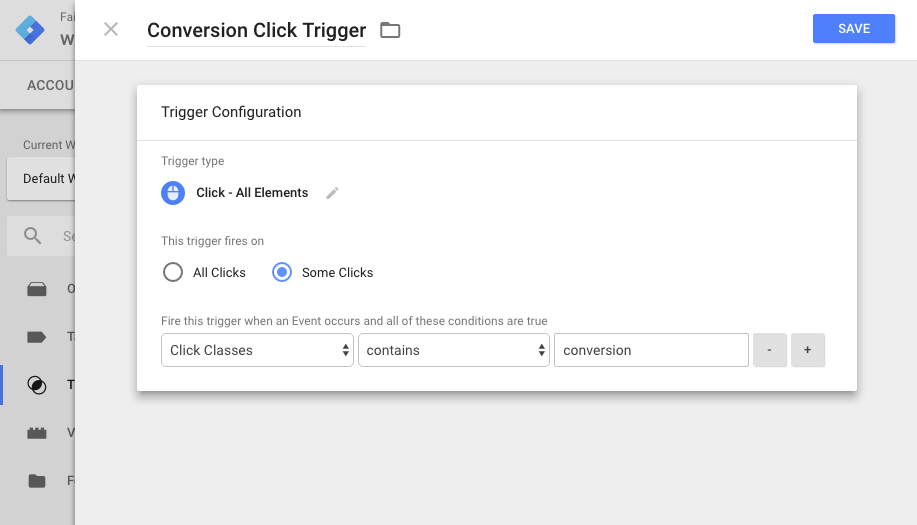

Using the Facebook pixel to track conversions is fairly straightforward if you have a “thank you” page where you can send users. There are several standard events, including ViewContent, AddToCart, AddToWishlist, InitiateCheckout, AddPaymentInfo, Purchase, Lead and CompleteRegistration, built right into the conversion pixel. Setting these up to fire is as simple as including a couple of lines of code on your thank you page. But, what if you want to track click events instead? How about time on page or scroll events? What if your conversion point is off-site? What if you’re running a single-page app where “page views” are difficult to track? There are a couple of different ways we can make this happen.

## Using Google Tag Manager

If you’re using Google Tag Manager to manage your Facebook pixel, setting up events is fairly straightforward. First, make sure your pixel is going to fire on the page you want to track. Then, create a new tag with a code snipped that looks something like this:

```javascript
<script>
  fbq('track', 'ViewContent', {
    content_type: 'product',
    content_ids: ['1234'],
    content_name: 'ABC Leather Sandal',
    content_category: 'Shoes'
    value: 0.50,
    currency: 'USD'
  });
</script>
```

Next, set up a trigger to fire when you want to send that event through to Facebook. If you’re tracking a click on a specific class of elements, your trigger might look something like this:



Or you could use a timed event, a form submission, a history change, a JavaScript error or even DOM ready or window loaded events. If it’s in GTM, you can use it.

The main issue with doing it this way is the number of tags and triggers you would be setting up. If you’re tracking a lot of events, you could quickly get to a point where keeping track of which tags go with which triggers can be confusing. And changing one could break things you didn’t realize were connected. There is a solution for this, however.

## Using JavaScript To Fire Events

We can use plain old JavaScript to fire Facebook (and GA) conversion events. We don’t even need jQuery! And the best part is, we can do it all inside of one single tag that can be triggered with any and all page views. As long as we use descriptive naming and commenting in our tag, we should be able to keep everything organized and easy to edit.

### Click Events

As an example, consider that you’re a marketer and you have a landing page with a link off the site to a page where the user can get in line (such as an urgent care facility) or make a reservation (such as a restaurant) or go to an offsite store (such as an Etsy or Amazon store). You don’t have any control over what the user does once they get to the conversion point. All you can do is optimize so that you get the most people clicking on the link to the third party. Let’s take a look at how we can fire off a Facebook conversion event on a click of any element, like a link or button. If you have access to the source code of the page, you can do something like this [as described in the Facebook documentation here](https://developers.facebook.com/docs/marketing-api/facebook-pixel/v2.8#inpageevents):

```javascript
<button onClick="onClick()">Buy Now</button>

<button onClick="onClick()">Buy as a Gift</button>

<script>
  function onClick() {
    fbq('track', 'InitiateCheckout', {
      content_name: 'Buy Now',
      content_category: 'Microconversions'
    });
  };
</script>
```

Simple enough, right? Here’s the thing, inlining functions like this is generally considered bad practice for a couple of reasons. First of all, mixing JavaScript in your HTML markup means, if you need to update a function (or its name) for any reason, you’ll need to go through each HTML file to find every instance of that function to update it. Second, you can only have one inline event assigned to a particular element. See [this StackOverflow answer](http://stackoverflow.com/questions/6348494/addeventlistener-vs-onclick) for more details but, if you need your button or link to do anything besides send conversion events to Facebook (change color, pop out a modal, whatever), you would be out of luck. What else can we do?

Enter `addEventListener`. This approach will solve both of the problems mentioned above. Since you don’t need to modify your HTML markup at all, you only need to worry about your JavaScript file. Update that file, and the function is updated everywhere it’s used. Secondly, you can attach multiple event listeners to the same element. They won’t overwrite each other so you don’t need to worry about your analytics events messing with your site’s functionality. Here’s a simple way to do the same thing with event listeners:

```javascript
<button id="buy-now">Buy Now</button>

<script>
  document.getElementById("buy-now").addEventListener("click", function(){
    fbq('track', 'InitiateCheckout', {
      content_name: 'Buy Now',
      content_category: 'Microconversions'
    });
  });
</script>
```

### Fire An Event After A Certain Scroll Amount

Here’s one that I don’t think even Google Tag Manager will let you set up. Let’s say you run a blog. You want to fire off an event anytime someone gets to the end of your posts, indicating that they have (possibly) read the entire thing. To do this, you need to know 3 things: 1) the ID of an element that is at the end of every article 2) that element’s distance from the top of the page and 3) where the user is on the page. A quick Google search returns a few million results about how to do such a thing in jQuery. But, for various reasons (mainly performance), you’ve decided not to include jQuery in your site. What do you do now? Let’s go step by step:

#### Step 1: Find an element that’s at the end of every article

Usually, this would be a comments section. But, it could be anything. Your footer, sharing buttons, a call to action, whatever. As long as it has a specific ID, it’ll be easy to grab like so:

```javascript
var endOfDocument = document.getElementById('comments')
```

#### Step 2: That element’s distance from the top of the page

This is a little trickier. After searching in vain for a while, I stumbled upon [Kirupa Chinnathambi’s post about getting an element’s position with vanilla Javascript](https://www.kirupa.com/html5/get_element_position_using_javascript.htm). We can get an element’s distance from the top of the page by using a quick calculation like so:

```javascript
el.offsetTop - el.scrollTop + el.clientTop
```

Now we’re cooking with gas! We’re about to hit a snag, though.

#### Step 3: Checking where the user is on the page

There are a couple of gotcha’s with this part. But, let’s get going and we’ll solve them as we go. Checking where the user is on the page is actually kind of simple. We can do it like so:

```javascript
// function to check scroll position
function fbScrollEvent() {
  window.requestAnimationFrame(function() {
    console.log(window.scrollY)
  })
}
```

And here’s the first gotcha. That function will check for the scroll position thousands of times per second. So, we need to set an interval to check for the scroll position so we’re not killing our site’s performance.

```javascript
// Get an element that is at the end of every post/page
var endOfDocument = document.getElementById('comments')

// function to check scroll position
function fbScrollEvent() {
  window.requestAnimationFrame(function() {
    console.log(window.scrollY)
  })
}

// We need to use a setInterval. Otherwise, your site will slow
// to a crawl.
var checkForOffset = setInterval(function() {
  window.addEventListener('scroll', fbScrollEvent(endOfDocument))
}, 100)
```

Now, we need to check to see if the current scroll position is greater than or equal to the position of our element. We’ll use Kirupa’s formula to check for that and only log to the console if it is greater than that.

```javascript
// Get an element that is at the end of every post/page
var endOfDocument = document.getElementById('comments')

// function to check scroll position
function fbScrollEvent(el) {
  window.requestAnimationFrame(function() {
    if (window.scrollY >= el.offsetTop - el.scrollTop + el.clientTop) {
      console.log(window.scrollY)
    }
  })
}

// We need to use a setInterval. Otherwise, your site will slow
// to a crawl.
setInterval(function() {
  window.addEventListener('scroll', fbScrollEvent(endOfDocument))
}, 100)
```

So now our function won’t run until we get to the position of the element we specify. Here’s the second gotcha. With our interval set to 100ms, our function will run 10 times per second for every second that the user has scrolled past the point we care about. Do you want thousands of conversion events? Because that’s how you get thousands of conversion events. In the interest of not negligently inflating our numbers, let’s see what we can do about that.

Thankfully, JavaScript gives us a way to remove event listeners after an action has taken place. It’s called (surprisingly enough) removeEventListener. Let’s use that to remove our scroll event listener once the user has scrolled to the comments section.

```javascript
// Get an element that is at the end of every post/page
var endOfDocument = document.getElementById('comments')

// function to check scroll position
function fbScrollEvent(el) {
  window.requestAnimationFrame(function() {
    // if the current scroll position is greater than or equal
    // to the position of the element, send your event
    if (window.scrollY >= el.offsetTop - el.scrollTop + el.clientTop) {
      // clear the interval so it doesn't keep checking
      clearInterval(checkForOffset)

      // log that our event was "sent"
      console.log('Facebook event sent')
    }
  })
}

// We need to use a setInterval. Otherwise, your site will slow
// to a crawl.
var checkForOffset = setInterval(function() {
  window.addEventListener('scroll', fbScrollEvent(endOfDocument))
}, 100)
```

And that brings us to our third gotcha. Let’s say we use the above method as it is to send a Facebook Pixel event. If, for some strange reason, we have it fire on a page that doesn’t have the Facebook Pixel on it, it will log at least one, possibly hundreds or thousands of errors. So, let’s check to make sure it exists on the page. If it does, we’ll send our event and log to the console that it worked. If it’s not on there, we’ll just log that the Facebook Pixel wasn’t found on the page. We can do that easily by checking to see if “fbq” is a function or not.

```javascript
// Get an element that is at the end of every post/page
var endOfDocument = document.getElementById('comments')

// function to check scroll position
function fbScrollEvent(el, listener) {
  window.requestAnimationFrame(function() {
    // if the current scroll position is greater than or equal
    // to the position of the element, send your event
    if (window.scrollY >= el.offsetTop - el.scrollTop + el.clientTop) {
      // clear the interval so it doesn't keep checking
      clearInterval(checkForOffset)

      // check that the facebook pixel exists on the page
      if (typeof fbq == 'function') {
        // send the event
        fbq('track', 'ViewContent', {
          content_name: 'Finished reading',
          content_category: 'Scroll',
        })

        // log that the event was sent (for testing purposes)
        console.log('Facebook event sent')
      } else {
        // log that the facebook pixel isn't on the page
        console.log('Facebook pixel not found')
      }
    }
  })
}

// We need to use a setInterval. Otherwise, your site will slow
// to a crawl.
var checkForOffset = setInterval(function() {
  window.addEventListener('scroll', fbScrollEvent(endOfDocument))
}, 100)
```

To my knowledge, there is nothing in here that shouldn’t work in anything from IE9 on up. Let me know if you have any issues with it.

## Conclusion

You won’t always need to track on page events with your Facebook Pixel. And when you do, you can always just use Google Tag Manager to handle it for you. But, if you find yourself tracking multiple events on each page and want to simplify your Tag Manager setup (or just learn more about JavaScript events), you can use these methods to help you out.
